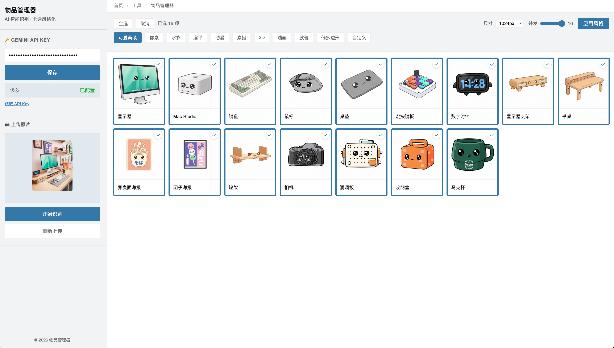

# 物品管理器

AI 智能物品识别与卡通风格化应用 - 上传照片，自动识别物品并批量生成多种风格的卡通图片。



## 在线访问

**GitHub Pages**: https://hills-dong.github.io/conductor-playground/

## 功能特性

### 智能识别
- 上传书桌/卧室/任意场景照片
- AI 自动识别照片中的所有物品
- 返回物品名称、描述和位置信息
- 支持识别失败自动重试（最多3次）

### 批量风格化
- **10种预设风格**: 可爱萌系、像素、水彩、扁平、动漫、素描、3D、油画、波普、低多边形
- **自定义风格**: 输入任意风格描述（如：赛博朋克、中国水墨画）
- **批量操作**: 支持全选、多选、取消选择
- **并发处理**: 可配置并发数（1-N），加速批量生成

### 配置选项
- **图片尺寸**: 128px / 256px / 512px / 1024px（默认）
- **并发数**: 滑块调节，最大值自动适配物品数量
- **API Key**: 本地存储，安全保存

### 界面设计
- 左右分栏布局，紧凑高效
- 面包屑导航
- Sticky 工具栏，滚动时固定
- 响应式卡片网格

## 本地运行

```bash
# 启动本地服务器
python -m http.server 8000

# 访问
open http://localhost:8000
```

## 技术栈

- **前端**: 纯 HTML5 + CSS（无框架依赖）
- **设计系统**: 参考豆瓣风格（Douban Blue #3377aa）
- **物品识别**: Gemini 3 Flash Preview
- **图像生成**: Gemini 2.5 Flash Image Generation

## 使用说明

1. 获取 [Gemini API Key](https://aistudio.google.com/app/apikey) 并保存
2. 上传包含多个物品的照片
3. 点击"开始识别"，等待 AI 识别完成
4. 选择要风格化的物品（可全选或多选）
5. 选择风格（或输入自定义风格）
6. 点击"应用风格"开始生成
